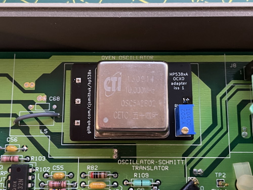
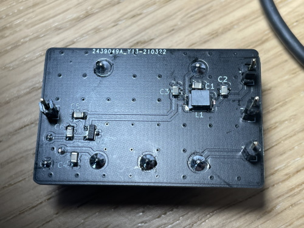

# HP 538xA frequency counter OCXO adapter board

This project allows a cheap CTI OSC5A2B02 to be installed in an HP 5384A, 
5385A or 5386A frequency counter instead of the original crystal or TCXO 
reference.

## Notes

Status: **PRODUCTION**

* Gerbers are available in [gerbers/](gerbers/)
* KiCad project avalable in [kicad/](kicad/)
* JLCPCB can provide boards.
* Please don't ask me for any boards or parts!

## BOM

| Reference | Part |
| -- | -- |
| C1-6 | 0805 100nF 50V X7R MLCC |
| L1 | 1812 1.2uH >800mA i.e. Murata LQH43NH1R2K03L |
| O1 | CTI OSC5A2B02 (available cheaply from eBay and AliExpress sellers) |
| U1 | MAX6064BEUR+T |
| RV1 | 5K Bourns 3296Y vertical |
| J1-4 | standard 2.54mm header pins (8 needed in total) |
| R95 | 100R 0.25W metal film TH resistor |

## Equipment

* Soldering iron
* 50MHz+ oscilloscope
* DMM
* 10MHz reference for calibration (Leo Bodnar GPSDO)
* Usual hand tools

## OCXO check out

Before performing this procedure it is advisable to check the OCXO function. If it arrives still soldered to a cut board (mine did), desolder it carefully.

1. Refer to the datasheet in the reference documentation section.
2. Attach 5v power supply to the OCXO
3. Attach oscilloscope 10x probe to the output/ground.
4. Check OCXO heats
5. Check OCXO output at 10MHz.

## Construction

1. Obtain the parts.
2. Install C1-6
3. Install L1
4. Install U1
5. Install J1-4 so they stick out from the bottom.
6. Remove the plastic spacers off 4 more pins and push onto the protruding pins to raise the height of the board from the host counter.
7. Install RV1
8. Orient the board SMD parts facing you, text upright and apply 5v to the top right (+) and middle right pins (-)
9. Measure voltage at U1/C6 junction. Should be approx 4V
10. Install O1.
11. Reconnect 5v supply and validate current < 600mA and > 300mA.
12. Wait for current to reduce to < 300mA. OCXO should be warm.
13. Orient the board SMD parts facing you, text upright and connect scope to bottom right pin and ground. Validate 10MHz square wave. Approx 5v p-p.

## Installation

1. Remove vinyl strips from side of counter
2. Remove feet
3. Remove 4 fixing screws in base
4. Release top of unit and slide off vertically
5. Remove 4 black mounting posts and two spring clips from side of unit
6. Remove two fixing screws holding base of case onto PCB
7. Remove base of case from PCB
8. As per service manual 2-52, remove C61-66, R96-99, R110, Q13, Q14, Y1C, W2. This is easier done if the GPIB interface card is removed first. If your counter has the TCXO, you only need to remove Y1B, R95 and W2.
9. Jumper L5 (short)
10. Replace R95 with 100R 0.25W.
11. Install the PCB in the position marked OVEN OSCILLATOR.
12. Place in bottom of case and reinstall the two fixing screws.

## Test procedure

1. Make sure reference switch on rear is set to internal.
2. Connect the mains but do not power the unit up.
3. Check that the OCXO module is warming up (finger is fine) in standby mode. 
4. Power up the unit.
5. Press CHECK on the front panel and make sure it reads 10.00000MHz
6. Reinstall GPIB board and proceed to adjustment section.

## Adjustment

1. Connect the counter reference output to your oscilloscope X channel
2. Connect your frequency standard output to your oscilloscope Y channel
3. Leave both units to warm for 2-4 hours.
4. Put the oscilloscope into X-Y mode and adjust gain until a loop is displayed.
5. Adjust the trimpot on the counter until the lissajous pattern is stable. This means both signals are at the same frequency.

## Reference documentation

* [CTI OSC5A2B02 datasheet](data/cti-osc5a2b02-datasheet.pdf)
* [CTI OSC5A2B02 drawings](data/cti-osc5a2b02-drawing.jpg)
* [MAX6064 datasheet](data/max606x-datasheet.pdf)