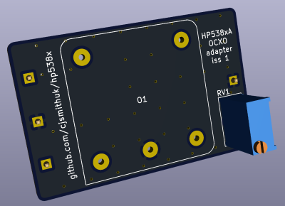
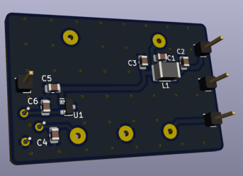

# HP 538xA frequency counter OCXO adapter board

This project allows a cheap CTI OSC5A2B02 to be installed in an HP 5384A, 
5385A or 5386A frequency counter instead of the original crystal or TCXO 
reference.

## Notes

Status: ALPHA untested.

KiCad project will be uploaded here eventually but Gerbers only for now.

## BOM

| Reference | Part |
| -- | -- |
| C1-6 | 0805 100nF 50V X7R MLCC |
| L1 | 1812 1.2uH >800mA i.e. Murata LQH43NH1R2K03L |
| O1 | CTI OSC5A2B02 |
| U1 | MAX6064BEUR+T |
| RV1 | 5K Bourns 3296Y vertical |
| J1-4 | standard 2.54mm header pins |

## Construction

TBD

## Installation

TBD

## Adjustment

TBD

## Reference documentation

* [CTI OSC5A2B02 datasheet](data/cti-osc5a2b02-datasheet.pdf)
* [CTI OSC5A2B02 drawings](data/cti-osc5a2b02-drawing.jpg)
* [MAX6064 datasheet](data/max606x-datasheet.pdf)